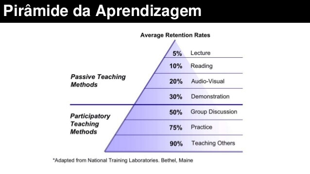

# Chamada Para Ação para profissionais de Ciência, Tecnologia, Engenharia e Matemática: incentivo de brincadeiras/projetos entre crianças

Você deve ter recebido esse link como um convite para dar sua opinião
profissional sobre material que pode _ser dado de presente_ que, via alguma
estratégia específica, estimule a criatividade de crianças e jovens adolecentes.
Você não precisa ser educador. Você não precisa nem ter filhos. Pense apenas:
**que tipos de presentes você, ao longo dos seus 4 a 16 anos, poderia ter
recebido e, com pequenas dicas ensináveis por uma prima sua que brinca com você,
teria te tornado um profissional mais preparado e um humano mais comprometido
com a sociedade?**

> As crianças de hoje estarão ainda mais sensíveis ao que é chamado [Sobrecarga
> de informação](https://en.wikipedia.org/wiki/Information_overload) do que eram
> seus pais. Isto implica também em aumento até de casos extremos como a
> [Síndrome da Fadiga de Informação](http://istoe.com.br/139296_INTOXICADOS+DE+INFORMACAO/)
> e, no mínimo, redução na capacidade de memorização também a médio e longo prazo.
> Do que adianta aprender algo que será esquecido? Seria possível com sua ajuda
> estratégias de brincadeiras que crianças usam criatividade e já aprendem algo
> simples que você parendeu apenas na faculdade sem requerer computador? E
> para pré-adolescentes, como induzir prazer na pesquisa _como brincadeira_
> para que tendam a preferir projetos mais educativos ou práticos do que
> ficar sobrecarregado com internet?

## Seu papel aqui

A chamada para sugestões é para _presentes com significado_ para pessoas de
4 a 16 anos poderiam aprender e replicar entre si, **sem ajuda de professor**,
usando tempo livre em que não estão na escola. Alguns podem exigir
acompanhamento de adulto ou de criança mais velha por exigir manuseio de alguma
ferramenta perigosa para idade da pessoa aprendiz, porém o foco principal é
tornar quem aprende um instrutor em potencial para outras crianças.

**Pense em uma rede de jovens que ensinam e são ensinados**.

Pode pensar isso como uma estratégia onde memes preparados por pessoas de áreas
como engenharia são teorizados e testados por filhos de outras pessoas das
mesmas áreas como estímulo para esses filhos e seus vizinhos, ou parentes, mesmo
que via interação por vídeo conferência, troquem informações que acreditem que
_estão apenas brincando_, mas lá no fundo estão também aprendendo método
científico, como construir sua própria rede mirim de pesquisa. Idealmente
os aprendizes tenderão a ficar maior parte do tempo com outros aprendizes,
sendo interação de instrutores mais para estimulação pontual do que contínua.

Essa hipótese não é apenas potencialmente boa para _filhos de engenheiros_ que
querem incentivar criatividade, mas também para pessoas mais carentes, pois
induz, por familiaridade, que crianças sejam mantidas juntas para algo que
vai além de brincadeira. A hipótese assume que ao menos algumas tardes por
semanas as crianças e jovens executariam ela, o que da em torno de 12 anos
de planejamento de _memes para Criatividade Familiar_.

### Exemplos de tipos de abordagens

#### Guia para aprender a lidar com materiais de matéria prima

Existem vários materiais que podem ser usados como matéria prima e, o processo
de preparação, para o que servem e como podem ser usados ou não, já com
consideração de toxicidade são pertinentes.

O ideal seria ter uma lista de produtos que podem ser produzidos como
matéria-prima para brinquedos/experimentos. Uma criança poderia fazer um
excercício com braço hidráulico usando seguingas com água interligadas com
canos de plastico com braços feitos de papelão. Que outros materiais poderiam
ser usados para substituir o papelão?

Que outros materiais podemos ter para subistuir papelão, com melhorias ou
perdas? Madeira? Gesso? E argila cozida?

No caso de argila cozida, tem alguma forma dela ser ainda mais resistente ao
adicionar algum material nela? Ou ao cozer de forma especial? Ou mesmo adicionar
algum material estrutural, como uma malha ou fios de ferro?

Há bastante espaço aqui para pessoal de exatas sugerir materias primas de outros
presentes cognitivos. Enquanto criança de 6 anos que tem irmão de 4 podem ficar
restritos a usar sem ajuda de adulto tesoura sem ponta e papelão dentro de um
apartamento, em idades maiores, com acompanhamento de adulto e com mais espaço,
como um sítio de um parente, seria viável até mesmo estimular criação de uma
forja capaz de derreter metais.

#### Guia de como criar um brinquedo que pode ser usado para provar algo sofisticado

Existem brinquedos que podem ser usados _meramente_ para brincar, como
ensinar a construir um carrinho. Esses tipos de brinquedos também são bem
vindos, pois também excercitam a habilidade do jovem em lidar com materiais,
ou mesmo capacidade artística e de imaginação.

Outra possibilidade são presentes que podem ensinar algo a mais, pode ser
visto no vídeo [How to Make Hydraulic Powered Robotic Arm from 
Cardboard](https://www.youtube.com/watch?v=P2r9U4wkjcc), [How To Make a Homemade
Robotic ARM](https://www.youtube.com/watch?v=WUYpr-K_LGo) ou, para quem é fã
de um certo jogo, [How To Make Assassin's Creed Hidden
Blade](https://www.youtube.com/watch?v=4t_aokFnUk8).

<!--
Além de listar vários desses brinquedos
-->

#### Desafio do tipo prove ou refute uma hipótese; deduza uma lógica (equação matemática)

Considere um exemplo prático deste tipo:

> Pense que você descobre uma meme onde, com materia prima e ferramentas,
> e uma abordagem especial, consegue induzir uma criança que de 9 anos
> a deduzir boa parte do Princípio de Arquimedes empiricamente SEM vocễ
> falar a formula correta. Caso essa criança consiga passar o mesmo
> experimento SEM dar detalhes avançados para outra criança, sua abordagem
> pode ser considerada um _meme_ da Criatividade Familiar. Você criou um
> presente cognitivo, onde a experiência de ser estimulada, passar muitas
> horas ou mesmo dias, leva a criança a deduzir algo que terá um índice
> de retenção de conhecimento muito maior do que ver televisão, pois pouco
> importa a longo prazo ler ou ver um vídeo se isso tenderá a ser esquecido.

Note: conforme o nível de aprendizagem da criança, seja razoável no nível
de desafio. Bons memes podem assumir certa liberdade para quem aplicar de qual
nível de profundidade da pergunta deve ser demonstrada. Uma criança de 5 anos
poderia ter que provar apenas que "empuxo existe", enquanto um jovem de 11
detalhar até a formula matemática.

Lembre-se: uma boa sugestão assume que, mesmo que você tenha conhecimento
profundo de uma área, outros instrutores mais velhos
(em geral pais/mães/tios/tias/avós/avôs) deverão saber o mínimo para ensinar
de uma forma que a criança deduza algo. Não assuma que tal pessoa irá ler
um livro ou ver vídeos longos para entender o meme. Ela provavelmente trabalha
e tem pouco tempo com a criança.

### Pontos a serem considerados

Recomenda-se ver em especial os seguintes pontos:

1. [Meme 4: Exatidão de manual de instrução reduz criatividade](../meme/4/criatividade-vs-manual-instrucao.md)
2. [Meme 5: A experiência completa da atividade, não apenas o resultado, é o real presente](../meme/5/presentes-com-significado.md)
3. [Meme 9: Atividades/projetos podem usar diferentes matérias-primas conforme estágio de desenvolvimento e disponibilidade](9/atividades-projetos-diferentes-materias-primas.md)

<!--

## Proposta de abordagem teorizada até o momento

## A ideia de como poderia ser implementado

A ideia é usar de formas eficiêntes de como cérebro aprende e retem informação, em especial
[metacognição](http://www.psicologiaexplica.com.br/o-que-e-metacognicao/).
Sem entrar em muitos detalhes, algo útil para você é conhecer a **piramide de
aprendizagem** a seguir, exibe uma chance de reter informação conforme o tipo de
ensino usado. Note como métodos de ensino passivo são muito menos eficientes.

Uma forma extremamente eficiente de aprender é ensinar, mais alta até mesmo que
um instrutor ensinar e o aprendiz aplicar na prática. A hipótese a ser testada
é **ensinar crianças algo que elas possam ensinar pra outras crianças**.

Outro ponto é criar algo(...)

Como há uma competição grande
com distrações, além de, idealmente, assumir que **as crianças/adolescentes
podem ter problemas de aprendizagem, como déficit de atenção, hiperatividade,
até mesmo autismo leve**

## Seu papel aqui

A chamada para sugestões é apenas para _brincadeiras/projetos_ que pessoas de
4 a 16 anos poderiam aprender e replicar entre si, **sem ajuda de professor**,
usando tempo livre em que não estão na escola. 

O ponto chave aqui é: um familiar adulto, sem esperiência com _Ciência,
Tecnologia, Engenharia e Matemática_ deverá ser capaz ler texto ou ver vídeo
explicando que materiais deve disponibilizar e como deve abordar os aprendizes.
Existem muitos vídeos na internet, como o [How to Make Hydraulic Powered
Robotic Arm from Cardboard](https://www.youtube.com/watch?v=P2r9U4wkjcc)

(...)

-->