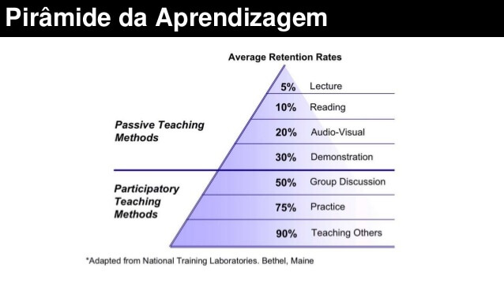

# Meme 11: A parcialmente plausível, ainda assim útil, Pirâmide de Aprendizagem
A Piramide de Aprendizagem é um meme amplamente divulgado quando se trata em
ensinar técnicas de aprender a aprender. Pode-se dizer que **uma metáfora
simplificada nas formas de reter informação aprendida**, que **é mais útil saber
do que desconhecer completamente**, porém ao repassar esse conhecimento adiante,
em especial se associado a imagens que afirmam _percentual exato_ a uma pessoa
leiga (que, na prática, é quase qualquer um que não seja um estudioso avançado
nas áreas de metacognição), você poderia se basear ou mesmo repassar integralmente
o seguinte:

> Está é uma imagem da Piramide de Aprendizagem. É uma forma poética de explicar
> que aprender de forma passiva tende a ser muito menos proveitoso do que de
> forma ativa. Pense comigo: concorda que é mais fácil aprender vendo um vídeo
> com audio e demonstração prática, do que ao ler um texto sem imagens? E nas
> formas ativas: concorda que ao explicar para um colega como fazer um
> excercício seu cérebro se força a aprender melhor do que apenas fazer o
> o excercício para outra pessoa? A dita Piramide de Aprendizagem quando
> inclui percentual poderia ser lida menos como _real e exata_ chance de
> como uma pessoa vai memorizar e mais como uma proporção. Outro ponto é que
> todos aprendem de forma diferente, um estudante que lê e faz um resumo
> será mais eficiênte do que outro que apenas lê um texto. O mesmo vale para
> aprendizagens ativas, pois um professor particular pode olhar a expressão
> facial do aprendiz e perceber que ele parece não entender, e usar isso a favor
> de mudar a forma de ensinar e ambos aprendem com isso.

A Hipótese da Criatividade Familiar é voltada também para pessoas que não tem
instrução avançada a dominar melhor seu processo de aprendizagem. O uso do
[Meme 1: Incerteza Criativa](../1/incerteza-criativa.md) é util aqui, pois
aprendizes iniciantes (ou com pouco tempo) vão ter alguma base para saber mais
sobre como aprender, já com abertura para o fato de que não é uma verdade
absoluta, enquanto aprendizes avançados (ou com mais tempo livre) irão pesquisar
mais a respeito.

## Origem Cone da Experiência de Edgar Dale

> "O Cone é uma analogia visual e, como todas as analogias, não tem uma relação
> exata e detalhada com os elementos complexos que representa"
> -- Edgar Dale

 O Cone of Experience é um modelo visual, um dispositivo pictórico que apresenta
 bandas de experiência organizadas Segundo grau de abstração e não grau de
 dificuldade. De acordo com Dale, "as faixas individuais do Cone da Experiência
 representam experiências que são fluidas, extensas e interagem continuamente".
 Não deve ser tomado literalmente em sua forma simplificada. Os diferentes
 tipos de ajuda sensorial muitas vezes se sobrepõem e às vezes se fundem um
 no outro. Imagens em movimento podem ser silenciosas ou podem combinar visão e
 som. Os alunos podem simplesmente ver uma demonstração ou podem vê-la e depois
 participar dela. Um tipo de experiência sensorial não é necessariamente mais
 útil do ponto de vista educacional do que outro. Experiências sensoriais são
 misturadas e inter-relacionadas.

