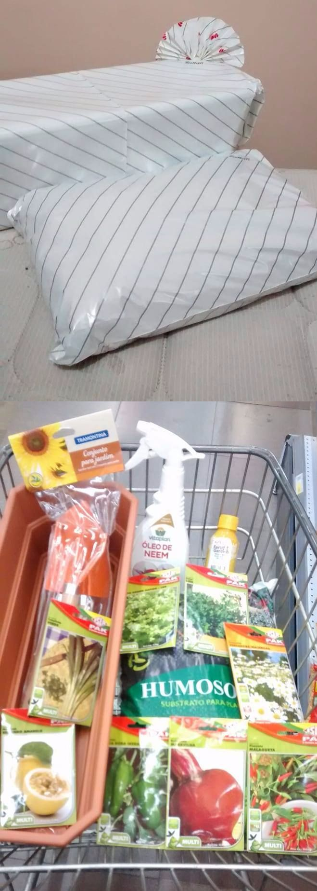
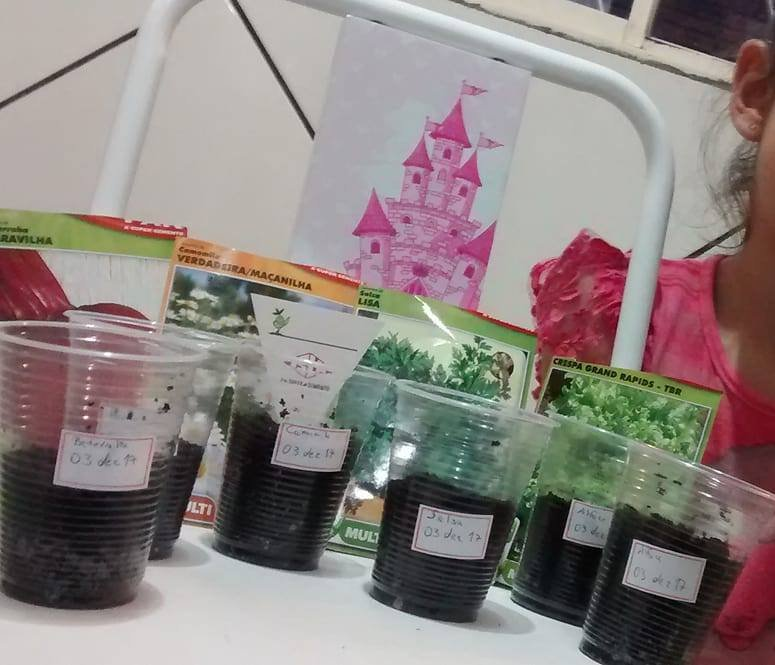

# Meme 12: Presentear com kit de jardinagem para apartamento

Valendo-se do [Meme 5: A experiência completa da atividade, não apenas o
resultado, é o real presente](../5/presentes-com-significado.md) este meme
promove a experiência de _chamada para ação_ para uma atividade que usa
como objetivo inicial palpável o cuidado com plantas. A pessoa mentora deve
ter em mente dois pontos chave: **1) ensinar o mínimo inicialmente necessário
para permitir a pessoa aprendiz a conseguir desenvolver a atividade de forma
independente** e, valendo-se do [Meme 2: Não sugira algo que não vai dar
imediatamente de presente](../2/presenteie-nao-sugira.md), **2) dar materiais
consumidos (sementes terra, ...) e preferencialmente dar (não apenas
emprestar) todas as ferramentas que a pessoa aprendiz ainda não possui**.

Esse meme é ideal para aprendizes que tem mais afinidade com tecnologia e menos
com atividades sensoriais. Os objetos que permitem ações de forma independente
da pessoa aprendiz são inclusive uma forma de redirecionar atenção dedicada
com uso de internet para aprendizagem com algo que podem tocar, sentir e
aprender.

Pontos extras a considerar levando em conta que uma meta geral é promover
criatividade:

- Procure promover independência e autoconfiança permitindo até mesmo que a
  pessoa aprendiz erre na sua frente sem super proteger; aprendizes imersos
  em um mundo digital podem ter um nível menor a frustração e erro, de modo que
  uma criança chorar ao derrubar sem querer uma muda no chão, você deixá-la
  entender seu próprio sentimento e depois ajudá-la a entender como resolver
  sozinha é um aprendizado para vida;
- Reforce que a experiência completa envolve também limpeza; mesmo que exista
  alguém que vá limpar para pessoa aprendiz (como os pais dela, ou pessoa
  aprendiz) faça questão de que ao menos o que é relativo a jardinagem a pessoa
  esteja auto consciente sobre que isso ela mesmo deve ser proativa (o que, note
  também contribui para independência, algo muito importante)
- Caso haja outros amigos da pessoa aprendiz (algo comum em um aniversário)
  pode ser muito interessante você como pessoa mentora ensinar também eles,
  de modo que todos saiam com mudas de plantas para casa; essas outras pessoas
  se tornam uma rede de influência positiva e em geral podem permanecer mais
  tempo junto com a pessoa aprendiz do que os próprios parentes
- Ensine como você aprendeu mas assuma que a criança pode querer copiar você,
  logo dê mais importância a formas que ela consiga isso; se ela tem internet,
  exiba você usando internet para aprender (como os vídeos de Youtube); se
  um amigo dela não tem internet em casa, procure alternativas sem obrigar
  todos a agirem de forma igual, como por exemplo dizer que a própria embalagem
  de sementes dá informações mínimas de como cuidar sem precisar da internet

## Informações básicas sobre os pontos chave

### Ponto chave 1: saber sobre jardinagem para apartamento
Não é necessário que você, pessoa mentora,  saiba sobre jardinagem, nem mesmo
que tenha experiência na área visto que o propósito deste meme é usar esse tema
apenas como uma _chamada para ação_ palpável.

Recomenda-se que use conteúdo audiovisual sobre o tema. Uma ótima plataforma
para encontrar é o Youtube, e um ótimo canal é o [Isaac horta em apartamento](https://www.youtube.com/channel/UCoviLqsSnbxIfE1hA1De-3w).

### Ponto chave 2: materiais e ferramentas presenteadas
Os materiais de consumo e ferramentas entregues (que, aqui, no sentido popular
são vistas como _o presente_, mesmo que este meme trate como a experiencia
completa ser o presente) são algo realmente muito, mas muito aberto a
interpretação e até mesmo a idade da pessoa aprendiz. **Note também os objetos
físicos entregues não requerem ter sido comprados exclusivamente para servirem
de presente se de alguma forma puderem ser obtidos pela pessoa mentora por
outros meios (como reciclagem, receber como doação, extração de sementes de
vegetais que já possuia, [fabricação de terra vegetal](https://www.youtube.com/watch?v=FcoCUyrSYH8),
etc)**.

#### Um exemplo mínimo
Esse é possívelmente o exemplo mínimo mais comum, tanto é que é uma experiência
típica ensinada nos anos iniciais na escola, e pode ser muito indicada se a
pessoa aprendiz é muito nova.

- Uma semente de feijão
- Algodão
- Copo
- Água

Existem diversas fontes para explicar como fazer, a exemplo de vídeos como este,
[Como plantar feijão no algodão!(Passo a Passo!)](https://www.youtube.com/watch?v=de0EaNWvZOM)

#### Exemplos mais complexos
Exemplos mais complexos que o do feijão no algodão vão depender do que você
pretende ensinar inicialmente para pessoa aprendiz. **O mínimo necessário
é entregar material mínimo para permitir a germinação (plantar a semente de
forma que possa gerar uma muda)**, o que tende a ser:

- **Sementes**, ou entregar vegetais e extrair junto com aprendiz ao vivo (requisito obrigatório)
- **Terra** (requisito obrigatório)
- **Local para plantar** (requisito obrigatório)
- Ferramentas (caso não use _as próprias mãos_, ou talheres como colher)
- Adubo conforme necessidade da planta (caso não faça parte do presente criar o
  próprio adubo ou terra vegetal).

Aviso 1: tenha em mente que mesmo que você queira dar um vaso grande,
dependendo da(s) semente(s) escolhidas, é mais ideal plantar em um copo menor,
como um copo pequeno de plástico de 50mL ou 90mL (copo descartável para café).

Aviso 2: há uma demora entre plantar a semente e a planta ficar grande, e isso
"faz parte da experiência desse meme", avise a pessoa aprendiz sobre isso e já
aproveite para prepará-la para as próximas etapas preferencialmente já tendo em
mãos a expectativa de datas. Tende a ser interessante começar com sementes
que dão resultado mais rápido como verduras ou flores (tempo de 2-3 meses) em
vez de algo mais complexo, como um pé de jabuticabeira [que, sem técnicas como
esta de gerar fruta em 4 meses poderiam levar uns 10 anos](https://www.youtube.com/watch?v=nKxtr04QPuw).

# Um exemplo de presente usando este meme

Nesse exemplo a pessoa mentora _também_ morava em apartamento, tinha pouco
tempo disponível para fazer a própria [terra vegetal](https://www.youtube.com/watch?v=FcoCUyrSYH8),
ou o próprio adubo, optou por comprar um vaso em vez [de fazer um vaso
autoirrigável que poderia ser até mais prático](https://www.youtube.com/watch?v=iZVYm-ghVTA)
e não tinha como produzir as próprias sementes. Some tudo isso ao fato de que
um mercado também permitia embalar tudo em papel de presente. O valor total
sem essas economias pode ser visto na nota a seguir, já com as descrições mais
exatas para caso você queira fazer quase o mesmo com seu presente:

Pontos a considerar para quem quer fazer algo parecido:
- Não necessariamente uma loja especializada oferecerá os melhores preços,
  em especial se você quer menor quantidade. A nota é de um supermercado,
  que tinha preços melhores do que outras lojas
- Preço de vaso varia significativamente entre lojas e entre modelos.
- Preço varia muito pela quantidade de sementes compradas. Não faz sentido
  comprar mais do que a menor quantidade disponível e, mesmo que você tenha
  dinheiro, opte por comprar mais sementes variadas e dar opção para pessoa
  aprendiz (foi o que fiz)
- O presente completo foi R$99,50, porém se fosse para escolher reduzir custos
  eu recomendaria remover o óleo de Neem e o adubo líquido. A terra estava muito
  barata e valeria a pena manter, principalmente sem contar com adubo extra
- Sementes da Isla, comuns em super mercado, tem uma vantagem ótima: o verso é
  muito explicativo de como plantar, o que pode ser bom para você mentor e a
  pessoa aprendiz
- As sementes são o mais importante e foram baratas: 8 tipos diferentes, já com
  embalagem auto explicativa, deram R$14,32. Se preço é um fator que pesa no seu
  bolso mas quer dar algo que "dure a longo prazo", note que além da sementes
  o único item que é difícil ser produzido é o kit de jardinagem da Tramontina
  que é lindo e custou apenas R19,90. Com valor suficiente para ficar abaixo
  de R$40,00, você poderia comprar ou um vaso menor, ou copinhos descartáveis
  para fase de germinação

**Ou seja: com criatividade os valores poderiam baixar de R$99,50 para menos de
R$40,00, sendo valor mínimo de R$14,32**.

## O presente

Veja como ficou a embalagem final e o que tinha dentro dela:

## O projeto inicial

Junto com a entrega de presentes, a pessoa mentora também ensinou como fazer o
plantio inicial:

